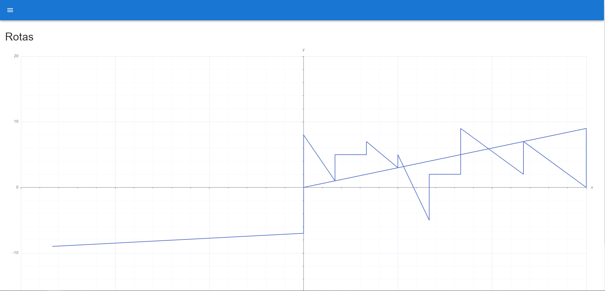

# Client Manager

Trata-se de uma aplicação de gestão de clientes, sendo possível visualizar e adicionar novos clientes, também como filtrar por nome ou e-mail, e visualizar a melhor rota para abordagem dos clientes com relação às coordenadas X e Y, tendo a empresa como marco (0, 0). A aplicação depende da API disponível .

# Sumário
- [Tecnologias utilizadas](#tecnologias)
- [Instruções para rodar o projeto](#instrucoes)
- [Demonstração](#demo)

## Tecnologias utilizadas 
- [**ReactJS**](https://react.dev/)
- [**TypeScript**](https://www.typescriptlang.org/)
- [**MUI**](https://mui.com/)
- [**Axios**](https://axios-http.com/ptbr/docs/intro)
- [**Apache Echarts**](https://echarts.apache.org/en/index.html)
- [**Vite**](https://vitejs.dev/)

## Instruções para rodar o projeto 
    Git
    Node v20.11.1

- Clone o repositório com o comando **git clone**:

      git clone git@github.com:danielbped/client-manager.git

- Entre no diretório que acabou de criar:

      cd client-manager

- Para o projeto funcionar na sua máquia, será necessário instalar suas dependências, para isso, utilize **npm install**:

      npm install

- Pronto, agora o projeto está pronto para ser rodado localmente, utilizando o comando **npm run dev**:

      npm run dev

    > ⚠️ A aplicação, por definição, estará rodando na porta 5137 ⚠️

## Demonstração 

### Login

### Página de Clientes

### Adicionando um novo cliente

### Filtrando cliente por nome

### Filtrando cliente por e-mail

### Página de rotas

